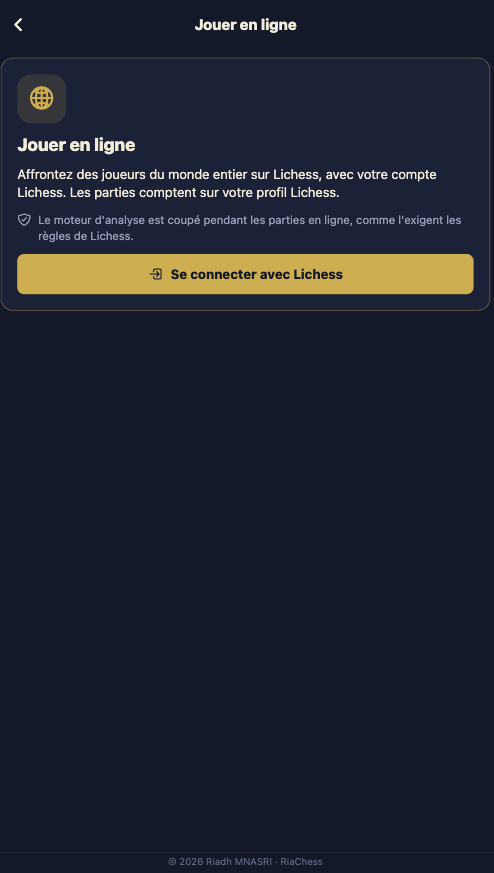

# RiaChess iOS

[Version française](README.md)

iPhone and iPad chess app by the [RiaChess](https://riachess.fr) club. iOS version of [RiaChess Android](https://github.com/riadh-mnasri/riachess-android), built from the same code (Expo / React Native). The goal: one app for playing (pass and play, against the computer, online), puzzles, game analysis and learning openings and endgames, with the club's coaching follow-up.

## Screenshots

| Home | Pass and play | Game over |
| --- | --- | --- |
|  |  |  |
| **Computer setup** | **Game against Stockfish** | **Puzzles** |
|  |  |  |
| **Live analysis** | **Game review** | **PGN import** |
|  |  |  |
| **Online play** | | |
|  | | |

Analysis and review: the Opera Game, Morphy against the Duke of Brunswick and Count Isouard (Paris, 1858).

## Contents

- [Screenshots](#screenshots)
- [Features](#features)
- [Try it on an iPhone](#try-it-on-an-iphone)
- [Tech stack](#tech-stack)
- [Architecture](#architecture)
- [Chess engine](#chess-engine)
- [Run locally](#run-locally)
- [npm scripts](#npm-scripts)
- [Tests](#tests)
- [Builds and release](#builds-and-release)
- [Roadmap](#roadmap)
- [Contributing](#contributing)
- [License and credits](#license-and-credits)

## Features

### Available

**Board**
- Tap to move (piece, then square) or drag and drop.
- Legal squares shown, captures marked with a ring.
- Last move and checked king highlighted.
- Coordinates on the board edge, board flip.
- Promotion piece picker.
- Vector pieces, sharp on every screen size.

**Pass and play**: two players on one device.

**Play the computer**: Stockfish 19, 8 levels, play White, Black or a random side. The engine thinks without blocking the interface. "Undo" takes back both your move and the computer's.

**Analysis**
- Continuous analysis of the position by Stockfish at full strength: evaluation bar, best line in algebraic notation, search depth.
- Best move arrow on the board; engine can be switched on and off.
- Game review: every position is evaluated, inaccuracies (?!), mistakes (?) and blunders (??) are flagged with Lichess thresholds.
- Accuracy of each player in %, clickable evaluation chart to jump to a move.
- Move by move navigation; playing another move starts a new line.
- PGN import (Lichess, chess.com...), free board, "Analyse the game" button at the end of a game.

**Puzzles**
- 2,464 puzzles from the Lichess database, offline, rated 400 to 2,800.
- Puzzle picked as close as possible to the player's rating, never the same one twice.
- Theme filters: mates, forks, pins, skewers, sacrifices, endgames.
- Automatic opponent replies; any mating move is accepted.
- Elo style rating, current streak and solved count, kept on the device.
- Retry or show the solution after a mistake.

**Online play (Lichess)**
- Sign in with a Lichess account (OAuth), with the right to play games only.
- Find an opponent at 10+0, 10+5, 15+10 or 30+0, casual or rated.
- Live clocks, resign, abort before the second move, offer and accept draws.
- Resumes a game already in progress, analyse the game once it is over.
- Engine off during online games, as Lichess fair play rules require.

**During a game**
- Check, checkmate and draw detection: stalemate, threefold repetition, 50-move rule, insufficient material.
- Captured pieces and material balance shown for each side.
- Move list in algebraic notation.
- Copy the game as PGN, with the date and player names.
- Haptic feedback on every move on phones.

**General**: French and English interface (device language by default, switch from the home screen), the club's navy and gold theme, copyright notice at the bottom of every screen.

### Coming next

Learn section, RiaChess account: see the [roadmap](#roadmap).

## Try it on an iPhone

**With Expo Go (no Apple account).**
1. Install [Expo Go](https://apps.apple.com/app/expo-go/id982107779) from the App Store.
2. Run `npm start` on the computer, with the iPhone on the same Wi-Fi.
3. Scan the QR code shown in the terminal with the camera.

**With TestFlight (installed app).** Requires an [Apple Developer](https://developer.apple.com/programs/) account ($99 a year). The app is built with the `production` profile, sent to App Store Connect, then installed from the TestFlight app.

**In the iOS simulator (Mac with Xcode).** The `simulator` profile produces a simulator app, with no Apple account.

## Tech stack

| Area | Choice |
| --- | --- |
| Framework | [Expo](https://expo.dev) SDK 57, React Native 0.86, strict TypeScript |
| Navigation | Expo Router (screens in `src/app/`) |
| Game rules | [chess.js](https://github.com/jhlywa/chess.js) |
| Board | Custom component: react-native-gesture-handler, react-native-svg |
| Engine | [Stockfish.js](https://github.com/nmrugg/stockfish.js) 19 (WASM), Web Worker or WebView |
| Tests | Jest (`jest-expo`) |
| Builds | EAS Build (iOS in the cloud) |

## Architecture

The code keeps game rules apart from rendering, so the logic stays testable without a phone:

```
src/
  app/                    Expo Router screens
    index.tsx             home
    play/local.tsx        pass and play
    play/bot.tsx          game against the computer
    analysis.tsx          analysis and game review
    puzzles.tsx           puzzles
    online.tsx            online play on Lichess
  domain/                 pure logic, no React or React Native
    game.ts               game state, moves, status, material, PGN
    bot.ts                computer levels, move choice
    analysis.ts           winning chances, move labels, accuracy
    puzzle.ts             puzzle flow, rating, puzzle choice
    online.ts             Lichess game: NDJSON stream, moves, clocks, result
  data/
    puzzles.json          selection from the Lichess puzzle database
  infrastructure/
    storage/              puzzle progress (AsyncStorage)
    lichess/              Board API client, OAuth sign in, token storage
    engine/               Stockfish adapters
      uci.ts              UCI protocol, request queue
      EngineHost.tsx      iPhone and iPad: hidden WebView
      EngineHost.web.tsx  web: Web Worker
      bootstrap.ts        Stockfish worker startup
  ui/
    board/                board, geometry, SVG pieces
    game/GameView.tsx     game screen shared by all modes
    analysis/             evaluation bar, review chart
    theme.ts              club colors
  i18n/                   FR/EN strings
scripts/
  build-engine.mjs        embeds Stockfish at install time
  build-puzzles.mjs       extracts puzzles from the Lichess database
```

**Principles**
- `domain/` depends on no framework. Game state is immutable: every move returns a new state.
- The engine is reached through a UCI interface (`UciTransport`). Swapping the WebView for a native module will not touch the rest of the app.
- Metro picks the adapter per platform through the `.web.tsx` and `.tsx` suffixes.

## Chess engine

The app embeds **Stockfish 19 "lite", single-threaded**: 1.8 MB of WASM with a smaller neural network. When dependencies are installed, `scripts/build-engine.mjs` turns it into a TypeScript module (`src/infrastructure/engine/generated/`, not committed). The engine therefore works **offline**.

- **Web**: the engine runs in a Web Worker created from the embedded script.
- **iPhone and iPad**: the same worker runs in a hidden WebView. It works in Expo Go, with no native module. A faster native C++ module is planned together with analysis.

**Levels**

| Level | Name | Skill Level | Depth | Max time | Random moves |
| --- | --- | --- | --- | --- | --- |
| 1 | Discovery | 0 | 1 | 50 ms | 45 % |
| 2 | Beginner | 0 | 2 | 100 ms | 25 % |
| 3 | Beginner + | 2 | 3 | 150 ms | 12 % |
| 4 | Club | 5 | 5 | 200 ms | 5 % |
| 5 | Club + | 8 | 6 | 300 ms | 0 % |
| 6 | Advanced | 11 | 8 | 400 ms | 0 % |
| 7 | Strong | 15 | 12 | 600 ms | 0 % |
| 8 | Maximum | 20 | 18 | 1 s | 0 % |

Even at its weakest setting, Stockfish is too strong for a beginner. The first levels therefore play some of their moves at random. These settings live in `src/domain/bot.ts`.

**Analysis**: the engine plays at full strength (Skill Level 20). Continuous analysis goes to depth 18. The review evaluates every position at depth 12, with at most 400 ms per position. Moves are labelled from the loss of winning chances (Lichess curve): 0.1 for an inaccuracy, 0.2 for a mistake, 0.3 for a blunder.

## Puzzles

Puzzles come from the [open Lichess database](https://database.lichess.org/#puzzles) (CC0 license, about 6 million puzzles). `scripts/build-puzzles.mjs` keeps a selection:
- popular puzzles (popularity ≥ 85), played at least 2,000 times, with a reliable rating (deviation ≤ 80);
- at most 125 puzzles per 100-point band, from 400 to 2,800, drawn at random in a reproducible way.

To rebuild the selection (`zstd` tool required):

```bash
curl -O https://database.lichess.org/lichess_db_puzzle.csv.zst
node scripts/build-puzzles.mjs lichess_db_puzzle.csv.zst
```

## Online play

Games are played on [Lichess](https://lichess.org) through the [Board API](https://lichess.org/api#tag/board):
- **Sign in**: OAuth with PKCE, no app registration. Only the `board:play` scope is requested. The token is kept in the phone's secure store (browser storage on the web).
- **Time controls**: Lichess only allows games against strangers from third-party apps at rapid or slower (estimated duration of at least 8 minutes). Blitz will only be possible through direct challenges.
- **Real time**: Lichess NDJSON streams (player events, game state) are read as they arrive with `expo/fetch`.
- **Fair play**: no engine help during an online game.

## Run locally

**Requirements**: Node.js 20 or newer, npm.

```bash
git clone https://github.com/riadh-mnasri/riachess-ios.git
cd riachess-ios
npm install        # installs dependencies and embeds Stockfish
npm run web        # opens the app in the browser: http://localhost:8191
npm start          # Metro on port 8191, for Expo Go or a development build
```

The development port is **8191** (8190 for the Android version, so both can run at the same time). No environment variables are needed yet.

## npm scripts

| Command | Purpose |
| --- | --- |
| `npm start` | Metro server (port 8191) |
| `npm run web` | Web version in the browser |
| `npm run ios` | Open the app in the iOS simulator |
| `npm test` | Jest tests |
| `npm run typecheck` | TypeScript check |
| `postinstall` | Regenerates the embedded Stockfish module (automatic) |

## Tests

```bash
npm test
npm run typecheck
```

The tests cover:
- **the domain**: legal moves, checkmate, stalemate, promotion, undo, material, PGN import and export, computer levels and move choice, winning chances, move labels, accuracy, puzzle flow, Elo rating, puzzle choice, online game (Lichess stream parsing, clocks, result);
- **board geometry**: touched square for each orientation, FEN parsing;
- **the UCI adapter**, with a fake engine: startup, best move, analysis, `info` line parsing, requests handled one after another.

Tests follow a `Given / When / Then` structure.

## Builds and release

Builds go through [EAS](https://docs.expo.dev/eas/), with no local Xcode. Profiles in `eas.json`:

| Profile | Output | Apple account | Use |
| --- | --- | --- | --- |
| `simulator` | iOS simulator app | No | Testing on a Mac |
| `preview` | IPA for registered iPhones | Yes | Testing on specific devices |
| `development` | Development build | Yes | Debugging native code |
| `production` | App Store IPA | Yes | TestFlight, then release |

```bash
npx eas-cli@latest login
npx eas-cli@latest build --platform ios --profile production
npx eas-cli@latest submit --platform ios   # upload to App Store Connect / TestFlight
```

Publishing on the App Store requires an Apple Developer account ($99 a year) and goes through Apple's review, usually 1 to 3 days.

## Roadmap

| Phase | Scope | Status |
| --- | --- | --- |
| 1. Foundations | Board, pass and play, PGN, FR/EN | Done |
| 2. Play the computer | Stockfish, 8 levels | Done |
| 3. Analysis | Evaluation bar, best moves, review, accuracy, PGN import | Done |
| 4. Puzzles | Offline Lichess puzzles (CC0), rating, themes | Done |
| 5. Learn | Opening repertoires with spaced repetition, endgame lessons | Planned |
| 6. Online play | Games on Lichess through the official API | Done, to be tested on a phone |
| 7. Accounts | Sign in with the riachess.fr account, premium status | Planned |
| 8. Club space | Coach assignments, student follow-up | After the MVP |

## Contributing

- Commit messages follow the Angular format: `type(scope): subject` (e.g. `feat(board): add premoves`).
- Before proposing a change, `npm test` and `npm run typecheck` must pass.
- Game logic goes in `src/domain/`, with its tests.

## License and credits

- Code licensed under [GPL-3.0-or-later](LICENSE), compatible with Stockfish.
- [Stockfish](https://stockfishchess.org) (GPLv3), through Nathan Rugg's WASM port [Stockfish.js](https://github.com/nmrugg/stockfish.js).
- "cburnett" pieces by Colin M.L. Burnett (GPLv2+), the default [Lichess](https://lichess.org) piece set.
- [chess.js](https://github.com/jhlywa/chess.js) (BSD-2-Clause).
- Puzzles: [Lichess database](https://database.lichess.org/#puzzles) (CC0).
- Online play: [Lichess API](https://lichess.org/api).

© 2026 Riadh MNASRI
